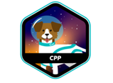

	

# CPP Piscine

Welcome to CPP Piscine, a 42 school project that introduces you to C++ and Object-Oriented Programming (OOP) through nine different modules.

## About

This project is designed to help you gain a deeper understanding of C++ and its library. It is exclusively built using C++ and Makefile. Each folder corresponds to one of the nine modules. As you progress through the modules, you will learn more about OOP and the resources C++ offers.

## Installation

To get started with CPP Piscine, follow these steps:

1. Clone the repository to your local machine:

    bash

	  	git clone https://github.com/LacrouxRaoni/42_cpp_piscine.git

2. Navigate to the folder of each module and exercise.
3. Run the ./projectName command, and you're ready to go!

That's it! We hope you enjoy your journey through CPP Piscine and learn a lot about C++ and OOP.
