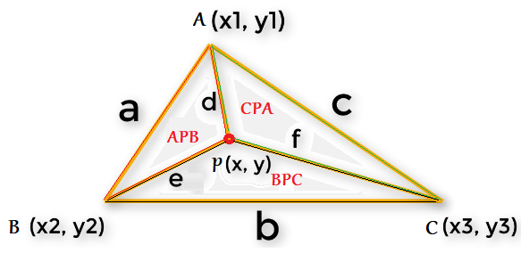

# CPP Pool 02/08

hird list in CPP Pool where we dive for the first time in a new C++ and POO

## About

This project utilize C++ library and Makefile only.

## Installation

```
git clone https://github.com/LacrouxRaoni/cpp01.git
```

in a folder you want; 

then go to the exercice folder and type make.

run ```./a.out``` and it's done!<br><br><br>

## Exercise 00 - My First Class in Orthodox Canonical Form

Exercise 00 introduces us about Orthodox Canonical Class Form.

### Orthodox Cannonical Class Form:

A standard OCCF is composed by:<br>
- Default Constructor<br>
- Copy Constructor<br>
- Descructor<br>
- Copy assigment operator

It is designed to help ensure that class implementations adhere to best practices, reduce the risk of errors, and make classes easier to maintain and debug.


Besides the OCCF class, it must contain a getter and setter methods to manipulate an integer fixed point value and a static constant integer named "fractional bit" size 8.


## Exercise 01 - Towards a more useful fixed-point number class

The Fixed class is pretty useless. So It's necessary to implement more methods. 

Two new type constructors: int and float converter to the corresponding fixed point. Two member functions that convert a fixed point to Integer or Float. Also, there is an overload insertion of the "<<" operator that always return the fixed point to float.


### Fixed Points: 

Fixed-point arithmetic is a method of representing and manipulating real numbers in a digital computer, using a fixed number of digits to the right and left of a binary point. It is used in digital signal processing, computer graphics, and other applications where high precision is not required. In fixed-point arithmetic, the position of the binary point is fixed and does not change during calculations. This is in contrast to floating-point arithmetic, where the binary point can change position during calculations. The advantage of fixed-point arithmetic is that it is simpler and faster than floating-point arithmetic, but it has a limited range of representable numbers and is not as accurate.

## Exercise 02 - Now we’re talking

This exercise we learn about overload and it's necessary creat overload metlhods of all operators below:

	<, <=, >, >=, ==, !=, ++, --, +, -, /, *

## Exercise 03 - BSP

The last exercise of this project is to use your `Fixed` class in conjunction with another class called `Point` to determine if a point lies within or outside of a triangle.

The `bsb.cpp` file contains the logic to solve this algorithm. We receive the three vertices of a triangle and a point as input.



The code basically calls a function to get the area 4 times:

- triangle area
- PAB area
- PAC area
- PBC area

The code then calculates the area of the three triangles formed by the point and each vertex of the original triangle. After that, it sums these areas and compares the result with the area of the original triangle. If they are equal, the point is within the triangle, otherwise it is outside of it.