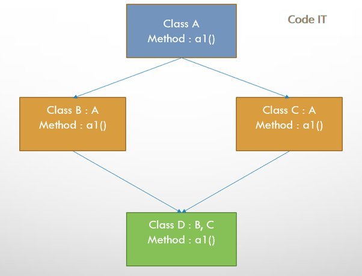
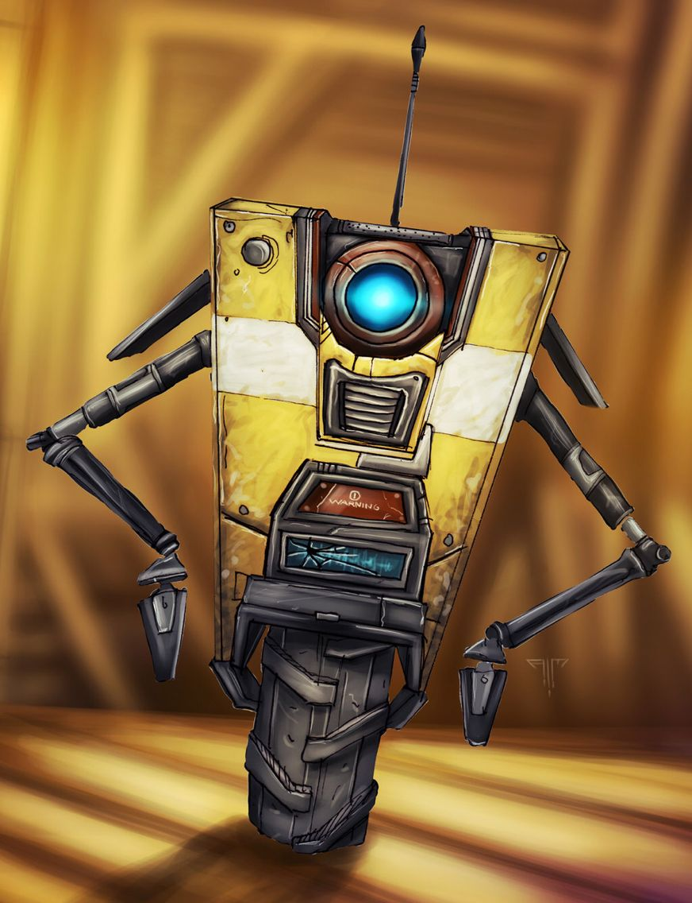
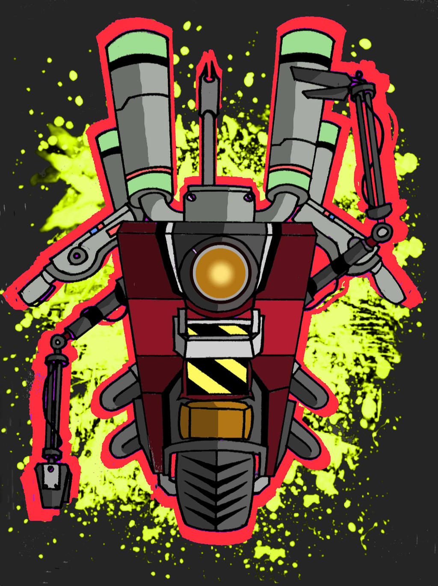

# CPP Pool 03/08

Fourth list in CPP Pool where we dive for the first time in a new C++ and POO

## About

In this list we will lern about inheritance

## Installation

```
git clone https://github.com/LacrouxRaoni/cpp01.git
```

in a folder you want; 

then go to the exercice folder and type make.

run ```./a.out``` and it's done!<br><br><br>

## Exercise 00 - Aaaaand... OPEN!

Exercise 00 we starts creting a class called ClapTrap:


ClapTrap have 4 private attributes: 
- Name <br>
- Hit point (initialized with 10 points) <br>
- Energy Point (initialized with 10 points) <br>
- Attack Damage

and the following public methods:
- Attack <br>
- Take Damage <br>
- Be Repaired <br>

The names of the methods explain their respective functions. The Attack and Be Repaired methods cost one energy point to use. If the hit points reach zero, `Claptrap` will not perform any actions. When `Claptrap` receives damage, it reduces the hit points amount.


## Exercise 01 - Serena, my love!

The second exercise requires creating a derived class called ScavTrap that inherits from ClapTrap. However, ScavTrap should display its own messages in its constructors and destructors.

### Inherits

Inheritance is a feature in object-oriented programming (OOP) that allows a new class to be derived from an existing class. The new class, known as the derived class or child class, inherits properties and methods from the existing class, known as the base class or parent class. This allows for code reuse and efficient organization of code.

Inheritance allows a derived class to inherit the properties and methods of the base class, and can also add new properties and methods, or override existing ones. This enables a clear and manageable class hierarchy, where common properties and methods can be defined in the base class and specialized properties and methods can be defined in the derived class.

In C++, Java and Python, you can use the keyword "extends" or ":", respectively, to indicate that a class is inheriting from another class.

Inheritance can also be of different types: single, multiple and multilevel.

- Single inheritance: When a class is derived from only one base class.
- Multiple inheritance: When a class is derived from multiple base classes.
- Multilevel inheritance: When a class is derived from a class which is already derived from another class.

Inheritance enables code reuse, but it's important to use it judiciously, as overuse can lead to overly complex class hierarchies and tight coupling between classes.


### ScavTrap Class

The ScavTrap uses the ClapTrap, and its attributes must be initialized as follows:

- Name, which is passed as parameter to a constructor
- Hit points (100), represent the health of the ClapTrap
- Energy points (50)
- Attack damage (20)

Also, ScavTrap has its own method called "guardGate()" that displays the message "ScavTrap is now in Gatekeeper mode."


## Exercise 02 - Repetitive work

This is basically a copy-paste of the last exercise. The main difference now is that we have a FragTrap class that inherits from ClapTrap with the same attributes as ScavTrap. The difference is that we don't have the guardGate() method, instead we have the highFiveGuys() method that displays a positive high-five request on the standard output.


## Exercise 03 - Now it’s weird!

The last class is called DiamondTrap. It inherits from both child classes (FragTrap and ScavTrap). The class should have attributes from both classe

- Name, which is passed as parameter to a constructor
- ClapTrap::name (parameter of the constructor + "_clap_name" suffix)
- Hit points (FragTrap)
- Energy points (ScavTrap)
- Attack damage (FragTrap)
- attack() (Scavtrap)

For last, there is its own method called whoAmI() that says the name of both inherited classes.

### The Diamond Problem

The "diamond problem" is a term used to describe an ambiguity that can occur in some object-oriented programming languages when multiple inheritance is allowed. The problem occurs when a class inherits from two or more classes that have a common base class. In this situation, the derived class inherits the same implementation of a method from both of its base classes, and the language's rules for resolving the ambiguity are unclear or inconsistent. This can lead to unexpected behavior or errors at runtime.

The diamond problem can be resolved in different ways, such as by using virtual inheritance, by providing a default implementation for the method in the base class, or by using interfaces rather than classes as the base types.

It's important to note that some programming languages like Python and Java don't have this problem because they don't support multiple inheritance, but instead they use other methods like composition, interfaces or mixins.




### flags

in Makefile we have -Wshadow and -Wno-shadow flags: 

-Wshadow is a warning flag in GCC (the GNU Compiler Collection) that alerts the developer when a variable declared within a certain scope shadows or hides a variable with the same name declared in an outer scope. This can lead to unexpected behavior and bugs in the program.

-Wno-shadow is the opposite of -Wshadow, it will turn off the shadow warning. This flag can be useful if you want to suppress the warning for specific cases where shadowing is intended and not a bug.

For example, if you have a global variable named x and a local variable named x in a function, the -Wshadow flag will generate a warning. If you use -Wno-shadow flag, no warning will be generated.


## Characters

### Claptrap:

`Claptrap` is a character in the Borderlands video game series. He is a robot with a distinct personality, and serves as both a comic relief and a guide for the player throughout the game. Claptrap is known for his quirky and often comical behavior, as well as his tendency to make puns and jokes. He is a fan favorite character in the Borderlands series.




### ScavTrap

ScavTrap is a character or enemy in the Borderlands video game series, developed by Gearbox Software. It is a type of robot known as a Claptrap, which serves as a scavenger and is programmed with the ability to search for and collect valuable resources. ScavTraps are generally considered to be weaker than other enemies in the game, but they can still pose a challenge to players if they are encountered in large numbers or if they are equipped with powerful weapons.



### FragTrap

Fragtrap is a character in the Borderlands series of video games, it is a Claptrap robot, like ScavTrap but it is a variant of Claptrap, and it is known for its ability to use special abilities in combat. It's also a character that players can control in the "Borderlands: The Pre-Sequel" game, as part of the four playable characters.
Fragtrap's abilities focus on elemental damage, crowd control and other utility skills.