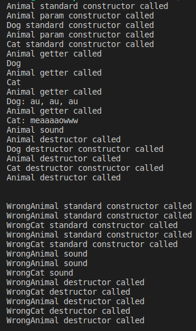

# Module 04

Module 04 is divided in four exercises.

## About

In this module, we will lern about polymorphism, abstract classes and interfaces.


## Exercise 00 - Polymorphism


### Polymorphism: 
	Polymorphism is a concept in object-oriented programming that refers to the ability of an object to take on multiple forms or have multiple behaviors. This can be achieved through inheritance, where a subclass can inherit methods and properties from a parent class and then override or extend them to provide its own implementation. Polymorphism can also be achieved through interfaces, where multiple classes can implement the same interface but provide their own implementation of its methods. The result is that code can be written in a more generic and reusable way, as different objects can be used interchangeably even if they have different underlying implementations.

### Virtual
	the virtual keyword is used to create a virtual function in a base class. A virtual function can be overridden in a derived class, which allows the derived class to provide its own implementation of the function. When a virtual function is called on an object, the implementation of the function that is called is determined at runtime based on the actual type of the object, rather than the type of the reference or pointer used to access it. This is known as dynamic dispatch or late binding.

	Using virtual functions and dynamic dispatch is a key feature of polymorphism in C++, which allows for more flexible and extensible code. When designing class hierarchies, it is often a good idea to include virtual functions where appropriate to allow for future expansion and customization. However, using virtual functions can have some performance overhead, so it is important to use them judiciously and with careful consideration of their impact on the design and performance of the program.


To exemplify polymorphism, we have five classes in this exercise:
- A class with the name "Animal".
- A class with the name "Dog" that inherits from the "Animal" class.
- A class with the name "Cat" that also inherits from the "Animal" class.
- A class with the name "WrongAnimal".
- A class with the name "WrongCat" that inherits from the "WrongAnimal" class.

The "Dog" and "Cat" classes are concrete classes that have their own method called ```makeSound()```. An "Animal" instance has a string attribute called "type" and a name that is given accordingly to the animal instantiated. Essentially, this is polymorphism acting behind the scenes. An "Animal" class can be a "Dog" or a "Cat" and have their own attributes, but a "Dog" can't be a "Cat" and vice versa.

The WrongAnimal and the WrongCat are another example of polymorphism. In the test, we replace the Animal and Cat with the new classes, but each class has its own ```makeSound()``` method without a ```virtual``` keyword in the parent class. The Animal object instantiated from WrongCat can't overload the ```makeSound()``` method. Therefore, we see the result is the same as when we instantiate an object from the Animal class.
We can see the result in terminal:





## Exercise 01 - I don’t want to set the world on fire


