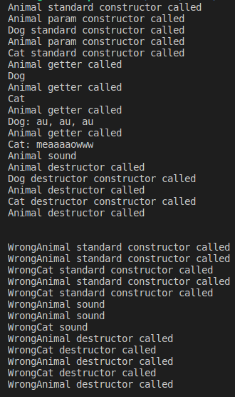
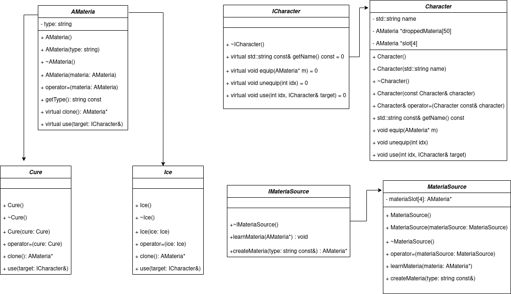

<p align="center">
  
</p>

# Module 04

Module 04 is divided in four exercises.

## About

In this module, we will lern about polymorphism, abstract classes and interfaces.


## Exercise 00 - Polymorphism


### Polymorphism: 
	Polymorphism is a concept in object-oriented programming that refers to the ability of an object to take on multiple forms or have multiple behaviors. This can be achieved through inheritance, where a subclass can inherit methods and properties from a parent class and then override or extend them to provide its own implementation. Polymorphism can also be achieved through interfaces, where multiple classes can implement the same interface but provide their own implementation of its methods. The result is that code can be written in a more generic and reusable way, as different objects can be used interchangeably even if they have different underlying implementations.

### Virtual
	the virtual keyword is used to create a virtual function in a base class. A virtual function can be overridden in a derived class, which allows the derived class to provide its own implementation of the function. When a virtual function is called on an object, the implementation of the function that is called is determined at runtime based on the actual type of the object, rather than the type of the reference or pointer used to access it. This is known as dynamic dispatch or late binding.

	Using virtual functions and dynamic dispatch is a key feature of polymorphism in C++, which allows for more flexible and extensible code. When designing class hierarchies, it is often a good idea to include virtual functions where appropriate to allow for future expansion and customization. However, using virtual functions can have some performance overhead, so it is important to use them judiciously and with careful consideration of their impact on the design and performance of the program.


To exemplify polymorphism, we have five classes in this exercise:
- A class with the name "Animal".
- A class with the name "Dog" that inherits from the "Animal" class.
- A class with the name "Cat" that also inherits from the "Animal" class.
- A class with the name "WrongAnimal".
- A class with the name "WrongCat" that inherits from the "WrongAnimal" class.

The "Dog" and "Cat" classes are concrete classes that have their own method called ```makeSound()```. An "Animal" instance has a string attribute called "type" and a name that is given accordingly to the animal instantiated. Essentially, this is polymorphism acting behind the scenes. An "Animal" class can be a "Dog" or a "Cat" and have their own attributes, but a "Dog" can't be a "Cat" and vice versa.

The WrongAnimal and the WrongCat are another example of polymorphism. In the test, we replace the Animal and Cat with the new classes, but each class has its own ```makeSound()``` method without a ```virtual``` keyword in the parent class. The Animal object instantiated from WrongCat can't overload the ```makeSound()``` method. Therefore, we see the result is the same as when we instantiate an object from the Animal class.
We can see the result in terminal:





## Exercise 01 - I don’t want to set the world on fire

### Deep Copy
	In C++, a deep copy is a type of copying that creates a new object and then copies the values of all the fields or data members of the original object to the new object. In other words, a deep copy creates an independent, duplicate copy of an object, with its own memory allocation

In this exercise, we are working with the same classes as before, as well as a new class called Brain. The Brain class contains a private array of 100 strings called "ideas".

In the Dog and Cat classes, we have added a private object of type Brain. When we create an object of type Dog or Cat, the Brain object created in each object must be a deep copy of the original. If we create just a shallow copy, the Brain object will share the same memory address with the copied one. This situation serves as a great example of the orthodox canonical class use.

Additionally, as part of this exercise, we need to create an array of animals in which half of the objects are Dogs and the other half are Cats. We will then test if everything is working correctly.


## Exercise 02 - Abstract class

### Abstract classes

	An abstract class is a type of class in object-oriented programming that cannot be instantiated directly. It is used as a base class or a super class, and is designed to be inherited by other classes. Abstract classes are often used to define a common interface for a group of related classes.

	An abstract class contains one or more abstract methods, which are methods that do not have an implementation in the abstract class, but must be implemented by the subclasses that inherit from it. Abstract classes may also contain non-abstract methods, fields, and other members that are common to all subclasses.

	To define an abstract class in C++, the class must be declared with the "abstract" keyword or at least one of its member functions must be declared as "pure virtual". A pure virtual function is a function that has no implementation in the base class and is declared with the "= 0" syntax at the end of the function declaration.

	One of the main benefits of using abstract classes is to achieve abstraction and encapsulation, which allow the code to be more modular, extensible, and maintainable. By defining a common interface in the abstract class, the subclasses can inherit and implement the interface in a way that fits their specific needs while still retaining the same interface as other classes.

	In summary, abstract classes are an important concept in object-oriented programming that provide a way to define a common interface and promote code reuse and maintainability.

In this exercise, we need to convert class A to an abstract class, which affects all other classes that inherit from the Animal class, including the Animal class itself. To accomplish this, we have included the letter A in the Animal class name, creating a new class called AAnimal. We have also changed the virtual method makeSound() to receive a value of 0, indicating that there is no implementation of this method in the parent class. As a result, all classes that inherit from AAnimal must implement their own version of the makeSound() method.

## Exercise 03 - Interface & recap

### Interfaces
	In object-oriented programming, an interface is a collection of method signatures (i.e., method names, return types, and arguments) that a class can implement. An interface defines a contract between the interface and the implementing class, specifying the behavior that the implementing class must provide.

	Interfaces allow for polymorphism, which is the ability of different objects to be treated as if they have the same type, as long as they implement the same interface. This allows for greater flexibility and reusability in code, as different objects can be used interchangeably as long as they implement the same interface.

	In Java, interfaces are declared using the "interface" keyword, and methods in the interface are by default abstract and public. Classes can then implement an interface using the "implements" keyword, and must provide implementations for all of the methods declared in the interface.

	Interfaces are often used to define contracts for common behaviors or operations that can be shared across multiple classes. For example, the Java Collections Framework defines a number of interfaces such as List, Set, and Map, which define common methods and behaviors for collections of data.

Since we are currently working with C++98, interfaces are not natively supported. However, we can still create our own interfaces to better understand their functionality and potential usefulness in our code.

In this exercise, we will create RPG characters with different classes such as Ice, Heal, and MateriaSource. We will also be working with an abstract class called Materia and interfaces called ICharacter and IMateriaSource.

The Ice and Heal classes inherit from the AMateria class and both have their own 'clone' methods that return new Ice or Heal Materia objects. These Materia objects can be used to target the ICharacter interface


The Character class inherits from the ICharacter interface and contains a string name as well as two arrays - one with a size of 4 to store materias, and another with a size of 50 to hold dropped materias.

The class includes three methods:

1. equip(): This method equips new materias. If the inventory is full, the method does not store the new materia and returns no message.

2. unequip(): This method is used to unequip a stored materia. Since we cannot delete the materia, it is instead stored in the dropped materia array.

3. use(): This method uses a materia and requires the slot index and an ICharacter target to be passed as arguments.


The MateriaSource class inherits from IMateriaSource and contains a size 4 array of Materia called materiaSlot. This class includes two methods:

1. learnMateria(): This method receives an AMateria object to store in the array. If the array is full, the method does not add the new AMateria object and does not return any message. This method provides a template to create new Materia objects as needed.

2. createMateria(): This method receives a string and checks if the string matches one of the values in materiaSlots. Them it returns a materia Ice or Cure. If the string does not match any values, nothing happens.

There are several tests in the main function to verify the following functionalities:

1. Deep copy: This tests whether copying one object into another creates a deep copy of the original object or not.

2. Polymorphic object creation: This tests whether creating Materia objects using polymorphism works correctly.

3. Materia usage in Character: This tests whether Materia can be included in a Character object and used correctly.

4. Materia usage in Enemy classes: This tests whether Materia can be used in Enemy classes and whether it functions correctly.

Although this exercise may be lengthy, it is very helpful in understanding various topics covered in the module. To help visualize the class structure, we have included a UML diagram below which shows all the classes and their inheritances:

