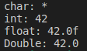

# Module 06

Module 06 is divided in three exercises.

## About

In this module, we will explore the use of casting in C++ to convert between different data types, as well as the process of serialization for storing data in a format that can be easily transmitted or saved. Casting is a technique used in programming to convert one type of data into another, while serialization refers to the process of converting data into a format that can be stored or transmitted.


## Exercise 00 - Conversion of scalar types

### Casting
	Casting is a technique used in C++ to convert one data type into another. There are two main types of casting in C++: static_cast and dynamic_cast.

	Static_cast is a basic type of casting that can be used to convert between types that are related to each other, such as converting an int to a double. It can also be used to perform some limited conversions between unrelated types, such as converting a pointer to a void pointer. However, static_cast does not perform any runtime checks and can be dangerous if used incorrectly.

	Dynamic_cast, on the other hand, is used to perform type checks at runtime and can be used to safely convert between types that are related by inheritance. For example, it can be used to convert a pointer to a base class into a pointer to a derived class, as long as the object being pointed to is actually an instance of the derived class. If the object being pointed to is not an instance of the derived class, dynamic_cast will return a null pointer.

	Overall, casting in C++ is a powerful technique that can be used to manipulate and transform data in a variety of ways. However, it is important to use casting carefully and with an understanding of its limitations and potential pitfalls.

### Upcasting and downcasting

	Upcasting and downcasting are terms used in object-oriented programming to describe conversions between related types.

	Upcasting is the process of converting a derived class reference or pointer to a base class reference or pointer. This is safe and can be done implicitly since a derived class is always a kind of its base class. Upcasting is useful when we need to treat an object of a derived class as an object of its base class.

	Downcasting, on the other hand, is the process of converting a base class reference or pointer to a derived class reference or pointer. This is not safe and requires explicit casting because not every base class is a derived class. Downcasting is used when we have a base class reference or pointer to an object of a derived class and want to access specific methods or properties of the derived class. If the object is not of the derived class type, the result can be undefined behavior or a runtime error.


In this exercise, we have a program that receives a string representation of a C++ literal in its most common form as a parameter. The literal must belong to one of the following scalar types: char, int, float, or double. Only decimal notation will be used for parameters other than char.

The program detects the format of the type and prints the value in the four scalar types as shown below when we send 42 as param:



A ```TypeFormat``` class has been implemented, which has one private string and four private methods: ```isChar()```, ```isInteger()```, ```isDouble()```, and ```isFloat()```.

The class constructor receives the string as a parameter, and each method checks its type before returning the corresponding value in one of the four scalar types: char, int, float, or double. Additionally, the ```isFloat()``` and ```isDouble()``` methods can detect pseudo types such as -inf, inff, +inf, inff, nan, or nanf in the string and return ```true``` when called.

In addition, a ```Converter``` class has been implemented, which inherits from ```TypeConverter```. Along with the standard methods, it has a public ```converterCheck()``` method.

The ```converterCheck()``` method includes an if/else tree that calls the appropriate ```TypeFormat``` methods. When a method returns true, the method calls the appropriate class to perform either an upcasting or a downcasting operation based on the value's type for the four scalar types.


## Exercise 01


## Exercise 02 - 

